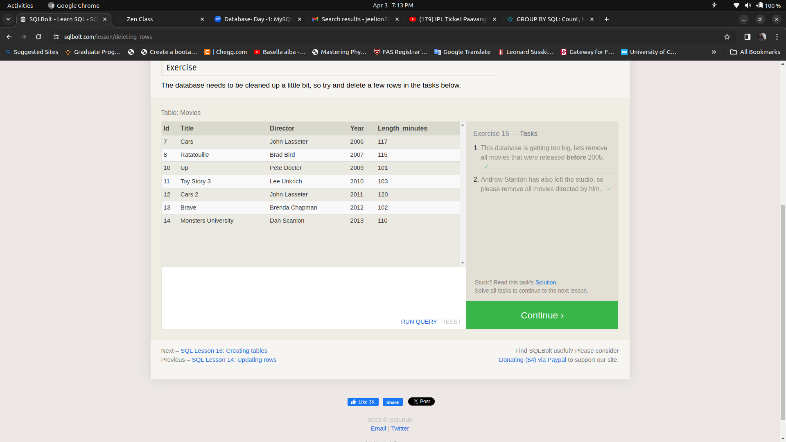

# React Router Task

In this repository, I have added screen shots of what I practiced SQL TASKS given in [SQLBOLT](https://sqlbolt.com/).

## Table of Contents

- [Introduction](#introduction)
- [Project Images](#Images)
- [Installation](#installation)
- [Usage](#usage)
- [License](#license)

## Introduction

In [SQLBOLT](https://sqlbolt.com/), we can find the tutorials about SQL(Structured Query Language) at all levels, it is very easy to understand and beginner friendly.
At the end of each section, there is a task, after completing that task, we will be allowed for the next section. The Basic of all CRUD and manipulation queries are covered.

## Images

The below images represent my practice of SQL.

## Installation

No installation is required except a latest web browser.

## Usage

The webpage is a reference for how tasks looks in [SQLBOLT](https://sqlbolt.com/).

## License

MIT License

## Acknowledgements

I thank [SQLBOLT](https://sqlbolt.com/) for their efforts to made such a tutorials that give opportunities to ALL learn SQL without any restriction.

---
